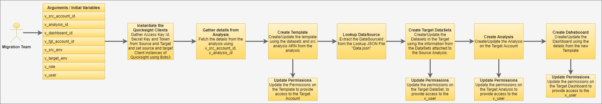
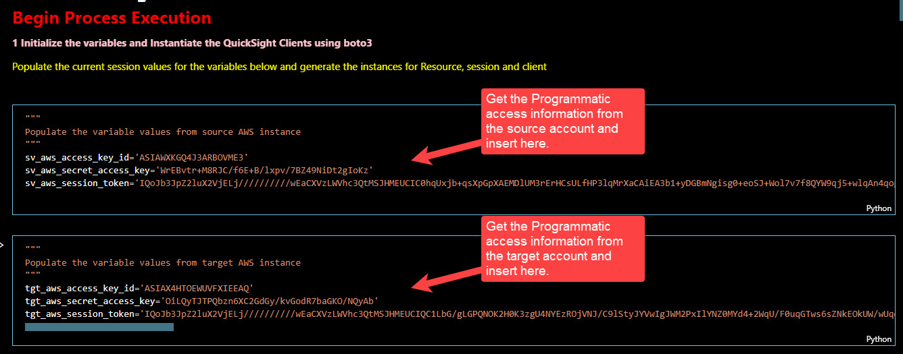
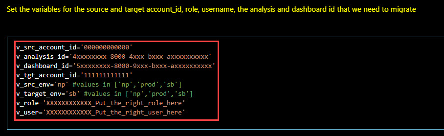

# __How to Migrate Quicksight Artefacts between two accounts/environments__
Recently, I got a chance to work on a project that, for the first time, exposed me to the world of Amazon Web Services. I have worked with AWS in the past, but never at the scale at which I am involved now. As part of the project, we have to build a data lake, analytic warehouses, and data marts that support the customer's operational and FP&A analytical needs. We have real-time as well as batch data flowing into the lakes. The architecture involves NiFi, AirFlow, Kafka, Spark. We are currently using cloud formation and data pipeline for Orchestration, but eventually, we plan to migrate to AirFlow. Understanding the architecture and the "what" and the "why" of it can be a discussion for another blog post. This blog post would focus primarily on the "oohs and ouches" of AWS Quicksight Migration and how to overcome those.\
I would be honest; I had never heard of AWS QuickSight before starting on this project. When I first started playing around with it, I thought it would grow on me, but it hasn't. I guess the tool is new, so we should give it a year or so before even beginning to compare it with OAC, Tableau, and Power BI.\
We started the development in the Non-Prod environment with pipelines, flowing the data into the data lake. Eventually, we had the structures ready in Athena to support some content-building in QuickSight. We developed some cool stuff with QuickSight and did multiple reviews. Finally, as we prepared for Migration, I found that there is no easy migration path for Quicskight from 1 account to another. In Legacy BI Tools and modern Viz tools, there is a way to export-import the artifacts to migrate between the environments. In QuickSight, AWS hasn't yet provided the flexibility of export-import. I was disappointed, so I started researching the material online. There is not much out there on QuickSight, but AWS's documentation is phenomenal, and the Boto3 came to the rescue.\
With Boto3, QuickSight has exposed its APIs, which we can stitch together to create a migration workflow for all the artifacts. In our case, we wanted to migrate DataSet, Analyses, Dashboards. Analyses and Dashboards require a Template to assist with the Migration. Because there is not much out there for assistance, the following sections would cover the Migration workflow and describe how to use the .ipynb file I have posted on GitHub to assist you with the migration needs if you ever have to work with QuickSight.\
The code and the blog make assumptions: 
* The Target Environment does not contain the same artifacts with a different ARN. Quicksight lets you create multiple objects with the same name but with different ARNs. 
* DataSources can be set up independently in the environments. However, a mapping table should map the source environment's data source id and the target environment's data source id. For our purpose, I have created a JSON file that provides that mapping. We have three environments: SandBox (SB), Non-Prod (NP), and Prod. I will go over the structure of the file later in the blog. You can choose to use XML or a table or a text file and change the logic for reading the mapping 
* The code does not have a lot of exception handling; it should be implemented as per the individual requirement. * The blog assumes that the reader has a foundational knowledge of AWS: What is ARN, key-pair, and token.

## Process and Code Walkthrough
Before we begin examining the steps, we need to ensure that the role that we use for migration, has the correct access to perform all the steps in the source account resources as well as the target account. I ran into these issues multiple times. I have listed down the list of Authorizations that we may need. This list may not be exhaustive but can be a good starting point
 * quicksight:CreateAnalysis
 * quicksight:CreateDashboard
 * quicksight:CreateDataSet
 * quicksight:CreateTemplate
 * quicksight:DescribeAnalysis
 * quicksight:DescribeDashboard
 * quicksight:DescribeDataSet
 * quicksight:DescribeDataSource
 * quicksight:DescribeTemplate
 * quicksight:ListAnalyses
 * quicksight:ListDashboardVersions
 * quicksight:ListDashboards
 * quicksight:ListTemplates
 * quicksight:UpdateAnalysis
 * quicksight:UpdateAnalysisPermissions
 * quicksight:UpdateDashboard
 * quicksight:UpdateDashboardPermissions
 * quicksight:UpdateDashboardPublishedVersion
 * quicksight:UpdateDataSet
 * quicksight:UpdateDataSetPermissions
 * quicksight:UpdateTemplate
 * quicksight:UpdateTemplatePermissions

 For an exhaustive list of Actions, please refer to https://docs.aws.amazon.com/service-authorization/latest/reference/list_amazonquicksight.html

Order of Execution:


## __1. Initialize the variables and Instantiate the QuickSight Clients using boto3__
* Use access_key_id, secret_access_key and token from the source and target environments to instantiate the QuickSight Clients

* Initialize the variables: Ensure that the correct values are set for the variables for each of these variables:\
v_src_account_id=?\
v_analysis_id=?\
v_dashboard_id=?\
v_tgt_account_id=?\
v_src_env='np' #values in ['np','prod','sb']\
v_target_env='sb' #values in ['np','prod','sb']\
v_role=?\
v_user=?


## __2. Analysis__
### *__2.1 Get the details for the Analysis from the Source Environment__*
The first step involves gathering the details of the Analysis based on the AnalysisID provided in the variable v_analysis_id. Next, we extract the name of the Analysis and the ARN, which are used in the upcoming steps. The code snippet is shown below. We iterate through the result set and break when we find a match on the AnalysisID. QuickSight APIs limit the results to only 100 rows at max and issues a 'NextToken', which can be further used to iterate through the result sets until a match is found.\
Using "v_analysis_id", gather the details and store the results in variables. The output of list_analyses, as most of the rest API responses, is a JSON string. We traverse through the dictionary to extract the relevant details. Most of the responses are similar, so we will not look into the code much for the description or list requests in the subsequent sections. You can refer to the GitHub link posted in the Appendix to fetch the code at each step.\
The crucial values that we collect here are Analysis ARN, Analysis Name, and we store these in the variables: src_analysisId, src_analysis_arn, and src_analysis_name.


```
analyses = client.list_analyses(
    AwsAccountId=v_src_account_id,
    MaxResults=100
)
v_analysis = []
y = [(member['Arn'],member['AnalysisId'],member['Name'], member['Status'],member['CreatedTime'],member['LastUpdatedTime']) for member in analyses["AnalysisSummaryList"] ]
v_analysis.extend(y)
while 'NextToken' in analyses:
        analyses = client.list_analyses(
            AwsAccountId=v_src_account_id,
            MaxResults=100,
            NextToken=analyses['NextToken']
            )
        y = [(member['Arn'],member['AnalysisId'],member['Name'] if ('Name' in member.keys()) else "", member['Status'],member['CreatedTime'],member['LastUpdatedTime']) for member in analyses["AnalysisSummaryList"] ]
        v_analysis.extend(y)
        #i+=len(analyses.get('AnalysisSummaryList'))
#print("Number of Analyses: " + str(i))
for analysis in v_analysis:    
    if analysis[1]==v_analysis_id and analysis[3].find('_SUCCESSFUL')!=-1 and analysis[3].find('DELETE')==-1:
        analysisId=analysis[1]
        analysisName=analysis[2]
        analysisArn=analysis[0]
        break
        
src_analysisId=analysisId
src_analysis_arn=analysisArn
src_analysis_name=analysisName
```
### *__2.2 Get the details for the Analysis from the Target Environment__*
Repeat the above step using the Target Account details and Target boto3 client instance, and check if the resource (Analysis) already exists with the same AnalysisID as provided in the variable v_analysis_id. The reasoning is that if we find a match, we will update the analysis, else we will create it. 
```
tgt_analysisId=analysisId
tgt_analysis_arn=analysisArn
tgt_analysis_name=analysisName
```
## __3. Create new Template in Source Account for Migration__
### *__3.1 Obtain new ID for Template and store in a variable__*
```
v_template_name=src_analysisId.replace(" ","")+"_MigrationTemplate"
```
### *__3.2 Generate a list of all datasets associated to the Analysis__*
The DataSets are required in the creation of the Template. An Analysis may be created with multiple Datasets. At the time of Template creation, we have to provide each Dataset associated with the Analysis.\
Each DataSet associated with the Analysis can be found in the Reponse provided by "describe_analysis" API call. Use the DataSet ARN provided in Response to query the API "list_data_sets further". In this step, we create three dictionaries to store the details of the DataSets associated with the Analysis. First, we create dictionaries with the key as the DataSet ARN.
* *v_src_DatasetArn_Dict*: DataSet ARNs as Items
* *v_src_DatasetArn_Id*: DataSet Ids as Items
* *v_src_DatasetName*: DataSet Names as Items
```
src_analysis_desc=client.describe_analysis(
    AwsAccountId=v_src_account_id,
    AnalysisId=src_analysisId
)

<call API list_datasets, and store the details of the dataset in the dictionary v_src_DatasetArn_Dict>
``` 
### *__3.3 Generate the List that is used to provide an input to SourceEntity.SourceAnalysis.DataSetReferences at the time of Template Creation.__*
The template body requires that we provide a list of all datasets (ARNs) and their placeholder names. As an example, please refer to the snippet below:\
*[{'DataSetPlaceholder': '4a5629cc-8898-4e50-b335-aeee70bad853_MigrationTemplateARN1', 'DataSetArn': 'arn:aws:quicksight:us-east-1:462393762422:dataset/h3359652-937a-4656-zbd7-2b17f163205d'},
{'DataSetPlaceholder': '3z5lmnop-6789-3547-a543-rtytg456753_MigrationTemplateARN2', 'DataSetArn': 'arn:aws:quicksight:us-east-1:462393762422:dataset/i3359652-937a-4656-axy7-2b17f1623450h'}]*

```
src_dataset_ARN_list=[]
n=0
for item in v_src_DatasetArn_Dict:
    n=n+1
    src_dataset_ARN_list.append(dict(DataSetPlaceholder=src_analysisId.replace(" ","")+"_MigrationTemplateARN"+str(n),DataSetArn=item))
```
### *__3.4 Create the new Template: If Template already exists, update it, else create it__*
This step uses the values of list "src_dataset_ARN_list" and "src_analysis_arn" to help create the Template for Migration. But first, we need to ensure that a template by the TemplateId = v_template_name doesn't already exist in the Account. In this step, we first call the API "list_templates" and traverse the results to verify if the Template already exists. If it exists, we update that template using API "update_template", else we create a new Template using the TemplateId = v_template_name by calling the API "create_template".
```
templateArn=''
templateId=''
templateName=''

<check if the template exists by calling "list_templates" and store its ARN in template ARN>
        
if templateArn:
    print("updating template")
    updateTemplate = client.update_template(
        AwsAccountId=v_src_account_id,
        TemplateId=v_template_name,
        SourceEntity={
            'SourceAnalysis': {
                'Arn': src_analysis_arn,
                'DataSetReferences': src_dataset_ARN_list
            }
        }
    )
else:
    print("creating template")
    createTemplate=client.create_template(
        AwsAccountId=v_src_account_id,
        TemplateId=v_template_name,
        SourceEntity={
            'SourceAnalysis': {
                'Arn': src_analysis_arn,
                'DataSetReferences': src_dataset_ARN_list
            }
        }
    )              
```
### *__3.5 Update the Permissions on the Template__*
Template is created in the source environment/account. For target Account to access it, the permissions have to be updated as shown below. Use "v_tgt_account_id" and the API "update_template_permissions" to perform the update
```
updateTemplate = client.update_template_permissions(
            AwsAccountId=v_src_account_id,
            TemplateId=v_template_name,
            GrantPermissions=[
                {
                    "Principal": "arn:aws:iam::"+v_tgt_account_id+":root",
                    'Actions': ["quicksight:UpdateTemplatePermissions","quicksight:DescribeTemplate"]
                },
            ]
        )
```
## __4. Create the DataSet in the Target Account__
### *__4.1 Lookup the Target Account DataSourceId from the Lookup file__*
In this step, we need to ensure that the PhysicalTableMap definition points to the Target Account's DataSource Id. Also, ensure that the AccountID in the ARN for the DataSource is set to the Target Account. In this process, we have assumed that DataSource definition may be different between the environments. So, we have eliminated a step where we programmatically extract the data source definitions from the Analysis. Instead, we have a lookup file that maps the data source ids between all the accounts. Then, based on the values in "v_src_env" and "v_target_env", we lookup the JSON file "data.json" on the keys and extract the target environment's data source id.\
Sample format of the file:
```
{
    "dsn": [
        {
            "name": "Athena",
            "prod": "cXXXXXX-fXXX-4XXX-8XXX-6XXXXXXXXXX",
            "np": "cYYYYYYY-fYYY-4YYY-8YYY-6YYYYYYYYY",
            "sb": "cZZZZZZZ-fZZZ-4ZZZ-8ZZZ-ZZZZZZZZZ"
        },
        {
            "name": "RedShift",
            "prod": "dXXXXXX-fXXX-4XXX-8XXX-6XXXXXXXXXX",
            "np": "dYYYYYYY-fYYY-4YYY-8YYY-6YYYYYYYYY",
            "sb": "dZZZZZZZ-fZZZ-4ZZZ-8ZZZ-ZZZZZZZZZ"
        }
    ]
}
```
We store this definition in the dictionary "get_dsn_mapping".
```
get_dsn_mapping_dict=dict()

with open('data.json') as json_file:
    dsn_list=json.load(json_file)
    
for i in dsn_list['dsn']:
    get_dsn_mapping_dict[i[v_src_env]]=i[v_target_env]

```
### *__4.2 Initialize the Loop and update the dataset definition, and create the datasets in Target Account__*
Use the "v_src_DatasetARN_Id" to loop through each of the DataSet Ids one at a time and create the definition for new DataSet that we need to create on Target.
We use "describe_data_set" API to generate a response and iterate through all the elements that we have to replace to prepare the dataset definition for the Target Account's DataSet creation.
In summary, we have to replace the source Account Id "v_src_account_id" with Target Account Id "v_tgt_account_id". The DataSource Ids are different; we also replace the DataSource Ids in the PhysicalTableMap definition.
Next, using API "list_data_sets", we query the target Account to check if the DataSet already exists. If it does, we update the DataSet, using a new definition, or we create it.
```
n=0    
for k in v_src_DatasetArn_Id:
    
    
    update_flag='N'
    ds=client.describe_data_set(
            AwsAccountId=v_src_account_id,
            DataSetId=v_src_DatasetArn_Id[k])

    item_list=[]
    for item in ds['DataSet']['PhysicalTableMap']:
        item_list.append(item)

    for i in item_list:
        for key in ds['DataSet']['PhysicalTableMap'][i]:
            temp_string=ds['DataSet']['PhysicalTableMap'][i][key]['DataSourceArn'].replace(v_src_account_id,v_tgt_account_id)
            replacement_dsn=get_dsn_mapping_dict[temp_string[temp_string.find('/')+1:]]
            if not replacement_dsn:
                print("raise issue")
            else:
                temp_string=temp_string.replace(temp_string[temp_string.find('/')+1:],replacement_dsn)
                ds['DataSet']['PhysicalTableMap'][i][key]['DataSourceArn']=temp_string
                
                
    datasets = tgt_client.list_data_sets(
        AwsAccountId=v_tgt_account_id,
        MaxResults=100
    )  

    v_datasets = []
    y = [(member['Arn'],member['DataSetId'],member['Name'], member['CreatedTime'],member['LastUpdatedTime']) for member in datasets["DataSetSummaries"] ]
    v_datasets.extend(y)
    while 'NextToken' in datasets:
            datasets = tgt_client.list_data_sets(
                AwsAccountId=v_tgt_account_id,
                MaxResults=100,
                NextToken=datasets['NextToken']
                )
            y = [(member['Arn'],member['DataSetId'],member['Name'] if ('Name' in member.keys()) else "", member['CreatedTime'],member['LastUpdatedTime']) for member in datasets["DataSetSummaries"] ]
            v_datasets.extend(y)
    for dataset in v_datasets:    
        if dataset[1]==ds['DataSet']['DataSetId']:
            print('dataset already exists. updating the dataset instead of creating.')
            ###run update here
            update_flag='Y'
            print("In Update")
            target_dataset = tgt_client.update_data_set(
                AwsAccountId=v_tgt_account_id,
                DataSetId=ds['DataSet']['DataSetId'],
                Name=ds['DataSet']['Name'],
                PhysicalTableMap=ds['DataSet']['PhysicalTableMap'],
                LogicalTableMap=ds['DataSet']['LogicalTableMap'],
                ImportMode=ds['DataSet']['ImportMode'])
            break

    #print(update_flag)
    
    if update_flag=='N':
        print('dataset does not exists. creating the dataset')
        target_dataset = tgt_client.create_data_set(AwsAccountId=v_tgt_account_id, 
                                                    DataSetId=ds['DataSet']['DataSetId'],
                                                    Name=ds['DataSet']['Name'],
                                                    PhysicalTableMap=ds['DataSet']['PhysicalTableMap'],
                                                    LogicalTableMap=ds['DataSet']['LogicalTableMap'],
                                                    ImportMode=ds['DataSet']['ImportMode'])
...<Loop Continued>

```
### *__4.3 Update the permissions on the Dataset__*
We need to update the permissions on the Datasets to make it available from the QuickSight UI. Use API "update_data_set_permissions", and update each DataSet within the loop
```
tgt_client.update_data_set_permissions(
    AwsAccountId=v_tgt_account_id,
    DataSetId=ds['DataSet']['DataSetId'],
    GrantPermissions=[
        {
            'Principal': 'arn:aws:quicksight:us-east-1:'+v_tgt_account_id+':user/default/'+v_role+'/'+v_user,
            'Actions': [
                'quicksight:UpdateDataSetPermissions','quicksight:DescribeDataSetPermissions','quicksight:PassDataSet','quicksight:CreateIngestion','quicksight:DescribeIngestion','quicksight:CancelIngestion','quicksight:ListIngestions','quicksight:UpdateDataSet','quicksight:DescribeDataSet','quicksight:DeleteDataSet'
            ]
        },
    ]
)  
...<Loop End>
```
## __5. Create Analysis in the Target Account__
### *__5.1 Loop through the list of dataset ARNs "src_dataset_ARN_List", and replace the source environment's account with target environment's account in the ARN__*
Store the newly created ARNs and Placeholder values in a new list "tgt_dataset_ARN_List". Since the new Analysis is created in the Target Environment, the definition for the DataSets associated with the analysis also needs updating. The step below ensures that.
```
temp_tgt_dict=dict()
tgt_dataset_ARN_List=[]
for i in src_dataset_ARN_list:
    temp_tgt_dict['DataSetPlaceholder']=i['DataSetPlaceholder']
    temp_tgt_dict['DataSetArn']=i['DataSetArn'].replace(v_src_account_id,v_tgt_account_id)
    tgt_dataset_ARN_List.append(temp_tgt_dict)
```
### *__5.2 Create or Update the Analysis.__*
We need the ARN for the source Template that was created. It is provided by "template_desc['Template']['Arn']". Also, use the list "tgt_dataset_ARN_list" to set DataSetReferences.\
Use "tgt_analysisId" to confirm if the Analysis already exists. If it does, call the API "update_analysis" to perform an update in the target account using src_analysisId and the newly created dataset ARNs and template ARN.
```
update_analysis(
                AwsAccountId=v_tgt_account_id,
                AnalysisId=src_analysisId,
                Name=tgt_analysis_name,
                SourceEntity={
                    'SourceTemplate': {
                        'DataSetReferences': tgt_dataset_ARN_List,
                        'Arn': template_desc['Template']['Arn']
                    }
                }
            )        
```

If the analysis does not exist, create a new one in the Target account.
```
create_analysis(
        AwsAccountId=v_tgt_account_id,
        AnalysisId=src_analysisId,
        Name=src_analysis_name,
        SourceEntity={
            'SourceTemplate': {
                'DataSetReferences': tgt_dataset_ARN_List,
                'Arn': template_desc['Template']['Arn']
            }
        }
    )
```
### *__5.3 Update the permissions on the Analysis.__*
Once the analysis has been created, update the permissions using "update_analysis_permissions". Ensure that the appropriate Actions have been specified in the body of the request
```
tgt_client.update_analysis_permissions(
    AwsAccountId=v_tgt_account_id,
    AnalysisId=src_analysisId,
    GrantPermissions=[
        {
            'Principal': 'arn:aws:quicksight:us-east-1:'+v_tgt_account_id+':user/default/'+v_role+'/'+v_user,
            'Actions': ['quicksight:RestoreAnalysis', 'quicksight:UpdateAnalysisPermissions', 'quicksight:DeleteAnalysis', 'quicksight:QueryAnalysis', 'quicksight:DescribeAnalysisPermissions', 'quicksight:DescribeAnalysis', 'quicksight:UpdateAnalysis']
        },
    ]
) 
```
## __6. Create Dashboard in the Target Account__
### *__6.1 Gather the Dashboard Details from Source Account__*
Using "v_dashboard_id" and API "list_dashboards", extract the name and the ARN of the Dashboard and store the values in src_dashboardId,src_dashboardArn, src_dashboardName 
### *__6.2 Gather the Dashboard Details from Source Account__*
Using "v_dashboard_id" and API "list_dashboards", verify if the Dashboard already exists in the Target Account. Store the values in "tgt_dashboardId", "tgt_dashboardName"
### *__6.3 Create or Update the Dashboard__*
If "tgt_dashboardId" has a value, then we perform an update operation on the Target Account using "tgt_dashboardId", "tgt_dashboardName" by issuing an API call "update_dashboard"
```
dashboard_response_update=tgt_client.update_dashboard(
        AwsAccountId=v_tgt_account_id,
        DashboardId=tgt_dashboardId,
        Name=tgt_dashboardName,
        SourceEntity={
            'SourceTemplate': {
                    'DataSetReferences': tgt_dataset_ARN_List,
                    'Arn': template_desc['Template']['Arn']
                }
        }
    )
```
else, we call the "create_dashboard" API using "src_dashboardId" and "src_dashboardName" as the parameters along with "v_tgt_account_id" and create a new dashboard on the Target Account.
```
dashboard_response_create=tgt_client.create_dashboard(
    AwsAccountId=v_tgt_account_id,
    DashboardId=src_dashboardId,
    Name=src_dashboardName,
    Permissions=[
        {
            'Principal': 'arn:aws:quicksight:us-east-1:'+v_tgt_account_id+':user/default/'+v_role+'/'+v_user,
            "Actions": ["quicksight:DescribeDashboard","quicksight:ListDashboardVersions","quicksight:UpdateDashboardPermissions","quicksight:QueryDashboard","quicksight:UpdateDashboard","quicksight:DeleteDashboard","quicksight:DescribeDashboardPermissions","quicksight:UpdateDashboardPublishedVersion"]
        },
    ],
    SourceEntity={
                'SourceTemplate': {
                    'DataSetReferences': tgt_dataset_ARN_List,
                    'Arn': template_desc['Template']['Arn']
                }
            },
    DashboardPublishOptions={
        'AdHocFilteringOption': {
            'AvailabilityStatus': 'DISABLED'
        },
        'ExportToCSVOption': {
            'AvailabilityStatus': 'ENABLED'
        },
        'SheetControlsOption': {
            'VisibilityState': 'COLLAPSED'
        }
    }
)
```
### *__6.4 Update the Dashboard Permissions__*
Once the dashboard has been created, update the permissions using "update_dashboard_permissions" API. Ensure that the appropriate Actions have been specified in the body of the request
```
update_dashboard_permissions(
        AwsAccountId=v_tgt_account_id,
        DashboardId=src_dashboardId,
        GrantPermissions=[
            {
                'Principal': 'arn:aws:quicksight:us-east-1:'+v_tgt_account_id+':user/default/'+v_role+'/'+v_user,
                "Actions": ["quicksight:DescribeDashboard","quicksight:ListDashboardVersions","quicksight:UpdateDashboardPermissions","quicksight:QueryDashboard","quicksight:UpdateDashboard","quicksight:DeleteDashboard","quicksight:DescribeDashboardPermissions","quicksight:UpdateDashboardPublishedVersion"]
            },
        ]
    )
```
### *__6.5 Publish the latest version of the Dashboard__*
In order for the latest version of teh Dashboard to be available for the users, please issue the "update_dashboard_published_version" API call with the latest version number. Latest version number can be found in the response body of the "update_dashboard" or the "create_dashboard" API Call.
```
tgt_client.update_dashboard_published_version(
        AwsAccountId=v_tgt_account_id,
        DashboardId=src_dashboardId,
        VersionNumber=published_version_number
    )
```
## __7. Appendix__
### *__7.1 Github Link to the code base (.ipynb notebook)__*
The code still needs a little bit of refactoring. Some of the control statements are redundant. A refined version will be published soon. In the meanwhile, the link can be utilized for the migration process.\

### *__7.2 Important AWS links__*
QuickSight boto3 API reference:\
https://boto3.amazonaws.com/v1/documentation/api/latest/reference/services/quicksight.html

### *__7.3 Glossary__*
| items                              | type     | dataType             | description                                                                                                                                                              |
| :--------------------------------- | :------- | :------------------- | :----------------------------------------------------------------------------------------------------------------------------------------------------------------------- |
| v_src_account_id                   | variable | string               | Account Id for the source                                                                                                                                                |
| v_analysis_id                      | variable | string               | Analysis Id for the analysis marked for migration                                                                                                                        |
| v_dashboard_id                     | variable | string               | Dashboard Id for the dashboard marked for migration                                                                                                                      |
| v_tgt_account_id                   | variable | string               | Account Id for the target                                                                                                                                                |
| v_src_env                          | variable | string               | this variable value is used to lookup the data.json lookup file on the DataSource Id                                                                                     |
| v_target_env                       | variable | string               | this variable value is extracted from data.json lookup file based on the lookup performed in on the v_src_env and data source id                                         |
| v_role                             | variable | string               | The role of the user performing the migration                                                                                                                            |
| v_user                             | variable | string               | The user performing migration                                                                                                                                            |
| aws_access_key_id                  | variable | string               | access key id for source account for programmatic access                                                                                                                 |
| aws_secret_access_key              | variable | string               | secret access key for source account for programmatic access                                                                                                             |
| aws_session_token                  | variable | string               | session token for source account for programmatic access                                                                                                                 |
| tgt_aws_access_key_id              | variable | string               | access key id for Target account for programmatic access                                                                                                                 |
| tgt_aws_secret_access_key          | variable | string               | secret access key for Target account for programmatic access                                                                                                             |
| tgt_aws_session_token              | variable | string               | session token for Target account for programmatic access                                                                                                                 |
| src_analysisId                     | variable | string               | Analysis ID for the source account as obtained by list_analyses API call                                                                                                 |
| src_analysis_arn                   | variable | string               | Analysis ARN for the source account as obtained by list_analyses API call                                                                                                |
| src_analysis_name                  | variable | string               | Analysis Name for the source account as obtained by list_analyses API call                                                                                               |
| tgt_analysisId                     | variable | string               | Analysis ID for the target account as obtained by list_analyses API call                                                                                                 |
| tgt_analysis_arn                   | variable | string               | Analysis ARN for the target account as obtained by list_analyses API call                                                                                                |
| tgt_analysis_name                  | variable | string               | Analysis Name for the target account as obtained by list_analyses API call                                                                                               |
| v_template_name                    | variable | string               | Template Id name for the new template                                                                                                                                    |
| src_analysis_desc                  | variable | JSON Response (dict) | Response of the describe_analysis API call on the source account                                                                                                         |
| list_analyses                      | API      |                      |                                                                                                                                                                          |
| describe_analysis                  | API      |                      |                                                                                                                                                                          |
| v_src_DatasetArn_Dict              | variable | dict                 | Dictionary object which holds the values of DataSetARNs for each of the DataSet along with ARN as the Key                                                                |
| v_src_DatasetArn_Id                | variable | dict                 | Dictionary object which holds the values of DataSetIds for each of the DataSet along with ARN as the Key                                                                 |
| v_src_DatasetName                  | variable | dict                 | Dictionary object which holds the values of DataSet Names for each of the DataSet along with ARN as the Key                                                              |
| list_data_sets                     | API      |                      |                                                                                                                                                                          |
| src_dataset_ARN_list               | variable | list                 | list of DataSet ARNs: Contains the Placeholder as well as the DataSet ARN for the source account                                                                         |
| templateArn                        | variable | string               | template ARN value from the Response of list_templates                                                                                                                   |
| templateId                         | variable | string               | template ID value from the Response of list_templates                                                                                                                    |
| templateName                       | variable | string               | template Name value from the Response of list_templates                                                                                                                  |
| update_template                    | API      |                      |                                                                                                                                                                          |
| create_template                    | API      |                      |                                                                                                                                                                          |
| describe_template                  | API      |                      |                                                                                                                                                                          |
| template_desc                      | variable | JSON Response (dict) | Response of the describe_template API Call.                                                                                                                              |
| update_template_permissions        | API      |                      |                                                                                                                                                                          |
| ds                                 | variable | JSON Response (dict) | Response of source account describe dataset                                                                                                                              |
| item_list                          | variable | list                 |                                                                                                                                                                          |
| datasets                           | variable | JSON Response (dict) | Response of target account describe dataset                                                                                                                              |
| temp_string                        | variable | string               | replace the value of source Account Id in datasource ARN with the target Account Id and store in this variable                                                           |
| replacement_dsn                    | variable | string               | replace the value of source DataSource Id in datasource ARN with the target DataSource Id and store in this variable                                                     |
| update_data_set                    | API      |                      |                                                                                                                                                                          |
| create_data_set                    | API      |                      |                                                                                                                                                                          |
| target_dataset                     | variable | JSON Response (dict) | Response of the update/create dataset API                                                                                                                                |
| update_data_set_permissions        | API      |                      |                                                                                                                                                                          |
| temp_tgt_dict                      | variable | dict                 | Dictionary is setup to store the value for DataSetPlaceholder and DataSetARN                                                                                             |
| tgt_dataset_ARN_List               | variable | list                 | The temp_tgt_dict value is appended to the list which is used as an input for SourceEntity.SourceTemplate.DataSetReferences in create_analysis/update_analysis API call. |
| tgt_analysis_desc                  | variable | JSON Response (dict) | Response of describe_analysis API on Target Account                                                                                                                      |
| describe_analysis                  | API      |                      |                                                                                                                                                                          |
| create_analysis                    | API      |                      |                                                                                                                                                                          |
| update_analysis                    | API      |                      |                                                                                                                                                                          |
| update_analysis_permissions        | API      |                      |                                                                                                                                                                          |
| src_dashboardId                    | variable | string               | Dashboard ID for Source Account                                                                                                                                          |
| src_dashboardArn                   | variable | string               | Dashboard ARN for Source Account                                                                                                                                         |
| src_dashboardName                  | variable | string               | Dashboard Name for Source Account                                                                                                                                        |
| list_dashboards                    | API      |                      |                                                                                                                                                                          |
| tgt_dashboardId                    | variable | string               | Dashboard ID for Target Account                                                                                                                                          |
| tgt_dashboardArn                   | variable | string               | Dashboard ARN for Target Account                                                                                                                                         |
| tgt_dashboardName                  | variable | string               | Dashboard Name for Target Account                                                                                                                                        |
| create_dashboard                   | API      |                      |                                                                                                                                                                          |
| published_version_number           | variable | int                  | Version of the Dashboard to be published                                                                                                                                 |
| describe_dashboard                 | API      |                      |                                                                                                                                                                          |
| tgt_dashboard_desc                 | variable | JSON Response (dict) | Describe Target Dashboard                                                                                                                                                |
| dashboard_response_update          | variable | JSON Response (dict) | Response from the update_dashboard API Call on Target Account                                                                                                            |
| dashboard_response_create          | variable | JSON Response (dict) | Response from the create_dashboard API Call on Target Account                                                                                                            |
| update_dashboard_permissions       | API      |                      |                                                                                                                                                                          |
| update_dashboard_published_version | API      |                      |                                                                                                                                                                          |
